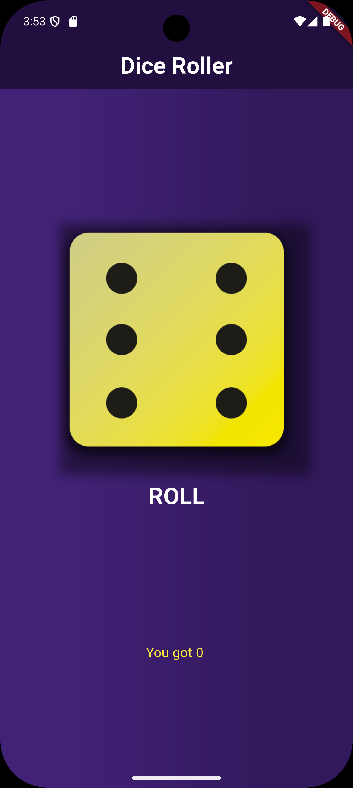
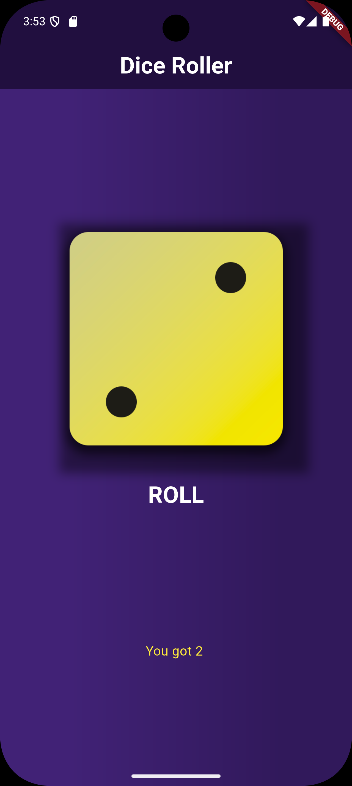
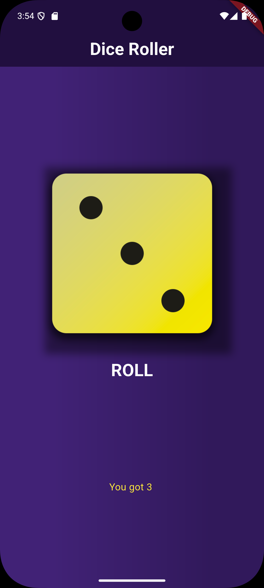
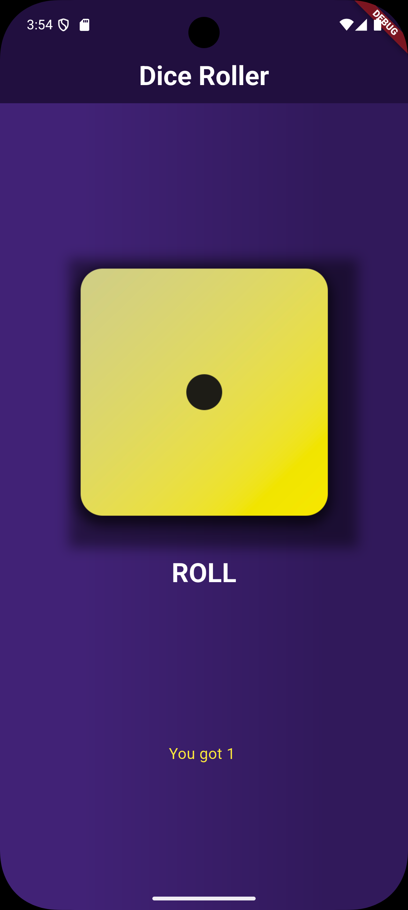

# 🎲 Simple Dice Roller with Beautiful UI

A visually appealing Flutter application that simulates rolling dice. It features smooth animations, clean custom dice graphics, and instant random number generation. This project demonstrates UI/UX implementation and state management in Flutter for simple interactive apps.

---

### 📸 App Screenshots

A visual walkthrough of the rolling process and different UI states.

| **Initial State** | **Mid-Roll Animation** | **High Roll Result** |
|:---:|:---:|:---:|
|  |  |  |
| *Tap to Roll* | *Smooth Animations* | *Clear Visual Result* |

<br>

| **Low Roll Result** | **Alternative View/Settings** | **Another Result** |
|:---:|:---:|:---:|
|  |  |  |
| *Snake Eyes!* | *Clean Interface* | *Instant Randomization* |

---

### 🛠️ Tech Stack

*  **Flutter Framework** - For the UI and animations.
*  **Dart Language** - Logic and random number generation.

---

### ✨ Key Features

* **Beautiful UI:** High-quality custom dice assets for a polished look.
* **Smooth Animations:** Realistic rolling effect when the dice are triggered.
* **Instant Randomization:** Utilizes Dart's `dart:math` library for true random results on every tap.

---

### 🚀 How to Run Locally

1. **Clone this repository**
   ```bash
   git clone [https://github.com/saadullah-001/DiceRoller-App.git](https://github.com/saadullah-001/DiceRoller-App.git)
